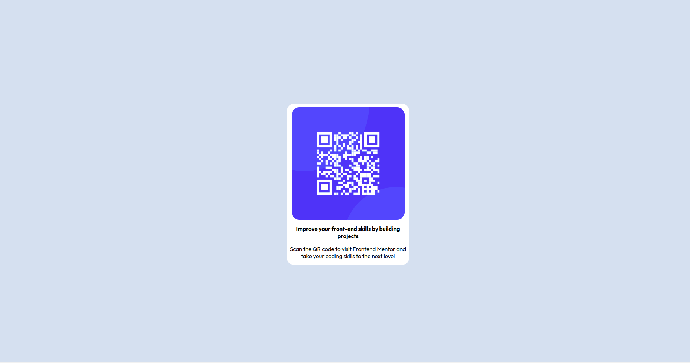

# Frontend Mentor - QR code component solution

This is a solution to the [QR code component challenge on Frontend Mentor](https://www.frontendmentor.io/challenges/qr-code-component-iux_sIO_H). Frontend Mentor challenges help you improve your coding skills by building realistic projects. 

## Table of contents

- [Overview](#overview)
  - [Screenshot](#screenshot)
  - [Links](#links)
- [My process](#my-process)
  - [Built with](#built-with)
  - [What I learned](#what-i-learned)
  - [Continued development](#continued-development)
  - [Useful resources](#useful-resources)
- [Author](#author)

## Overview

### Screenshot



### Links

- Solution URL: [GitHub](https://github.com/icaro-melo100/qrCodeComponent)

## My process

### Built with

- CSS custom properties
- Flexbox
- Mobile-first workflow

### What I learned

I used this little project to learn and train about flexy boxes.

This is a great way to mantain an organized website.

```css
.container {
  display: flex;
  width: 100%;
  height: 100%;
  flex-direction: column;
  flex-wrap: nowrap;
  justify-content: center;
  align-items: center;
  align-content: center;
}

.container-div {
  flex: 0 1 auto;
  align-self: auto;
  background-color: white;
  border-radius: 20px;
  display: flex;
  flex-direction: column;
  flex-wrap: nowrap;
  justify-content: center;
  align-items: center;
  align-content: center;
  text-align: justify;
  width: 325px;
}
```

### Continued development

After this, I want to improve my skills with responsive websites.

Besides, developing more complex websites.
### Useful resources

- [Flexy Boxes](https://the-echoplex.net/flexyboxes/) - Helped a lot

## Author

- Frontend Mentor - [@icaro-melo100](https://www.frontendmentor.io/profile/icaro-melo100)
